# 🦾 ELA230 - Introdução ao Projeto de Robôs 🦾

## 📋 Descrição
Repositório com a finalidade de acompanhar o desenvolvimento de um braço robótico de 4 eixos em conjunto com a matéria de Robótica (CCR240).

  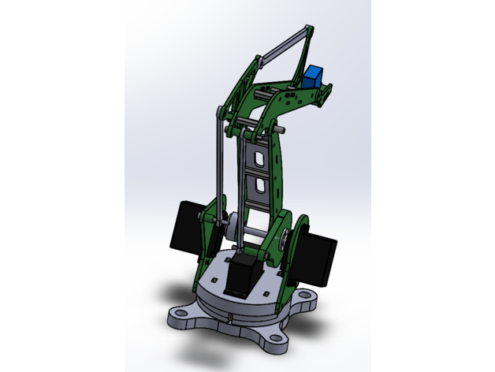
  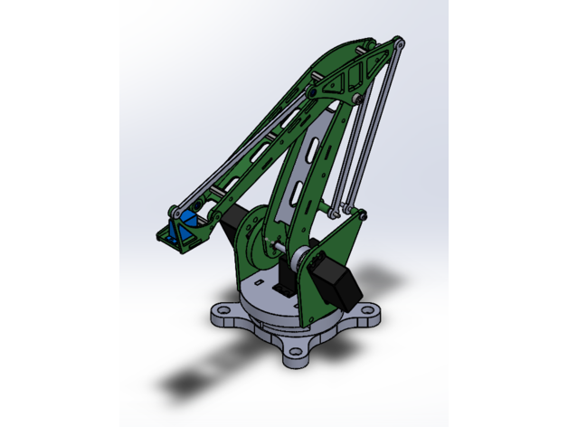 

Para acessar todos os arquivos do Robô [Clique Aqui](docs/robot_files/).

[Link do Projeto no Thingiverse.](https://www.thingiverse.com/thing:4982741/files)
***

## ⚙️ Ambiente Utilizado
* Raspberry Pi 3 B+ 
* PCA9685
***

## Configurando o Ambiente
Primeiro de tudo deve-se ter um Raspberry Pi configurado com o OS atualizado, para isso você pode seguir os passos fornecidos pelo site [Clicando Aqui](https://projects.raspberrypi.org/en/projects/raspberry-pi-setting-up).

Para as ligações e configurações do módulo PCA9685 basta seguir os passos do vídeo [Clicando Aqui](https://www.youtube.com/watch?v=9).
***

## 🔨 Montagem do Robô
Para acessar o pdf utilizado como base para montagem [Clique Aqui](docs/Robot_4_axes.PDF).

### Lista de Materiais
| N° do Artigo |     Nome       |    Descrição     | QTE |
| ------------ | -------------- | ---------------- | --- |
|      1       |  3x7x3         | ball bearing     |  8  |
|      2       |  40x68x15      | ball bearing     |  1  |
|      3       |  5_9_3 (2)     | ball bearing     |  5  |
|      4       |  Servo MG996R  | Servo motor      |  3  |
|      5       |  Servo 9g SG90 | Servo motor      |  1  |
|      6       |  Servo disc    |         -        |  3  |
|      7       |  arbre 6x46.8  |         -        |  1  |
|      8       |  HNH-BRN-M3-25 | Hexagonal spacer |  4  |
|      9       |  HNH-BRN-M3-20 | Hexagonal spacer |  4  |
|      10      |  CSH-STN-M5-55 | M5 * 55          |  1  |
|      11      |  SCB3_25       | M3 * 25          |  1  |
|      12      |  SCB3_30       | M3 * 30          |  2  |
|      13      |  001           |         -        |  1  |
|      14      |  002           |         -        |  1  |
|      15      |  100           |         -        |  2  |
|      16      |  101           |         -        |  1  |
|      17      |  102           |         -        |  1  |
|      18      |  103           |         -        |  1  |
|      19      |  104           |         -        |  1  |
|      20      |  105           |         -        |  1  |
|      21      |  106           |         -        |  1  |
|      22      |  107           |         -        |  1  |
|      23      |  107           |         -        |  1  |
|      24      |  300           |         -        |  1  |
|      25      |  Symétrie_300  | Symétrie_300     |  1  |
|      26      |  301           |         -        |  1  |
|      27      |  302           |         -        |  2  |
|      28      |  400           |         -        |  1  |
|      29      |  401           |         -        |  1  |
|      30      |  402           |         -        |  1  |
|      31      |  support       |         -        |  1  |
|      32      |  150           |         -        |  2  |
|      33      |  168           |         -        |  1  |

### 🧩 Peças

001                                   |            002                         |                100   
:------------------------------------:|:--------------------------------------:|:--------------------------------------:
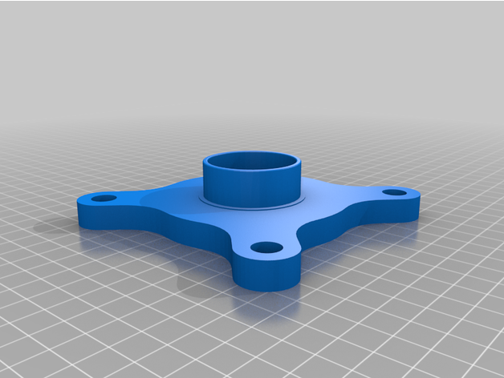  |    |  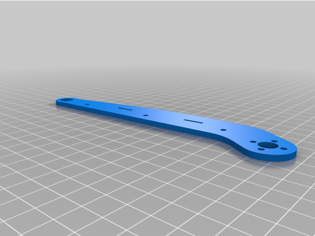

101                                   |            102                         |            103   
:------------------------------------:|:--------------------------------------:|:--------------------------------------:
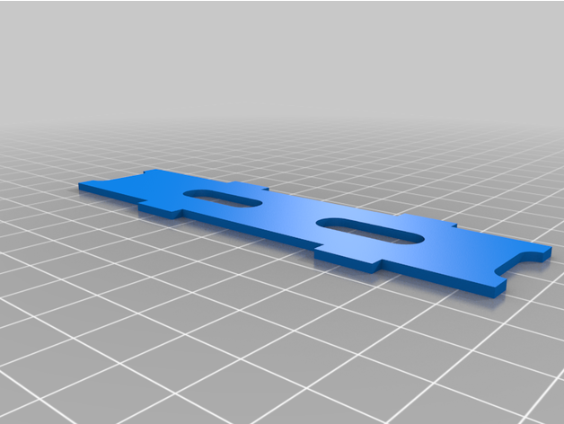  |  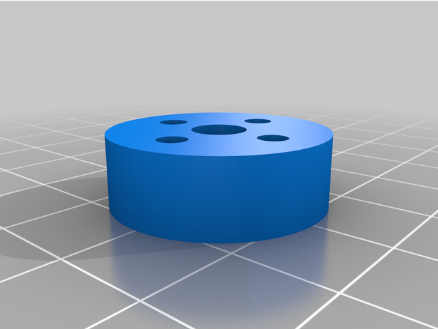  |  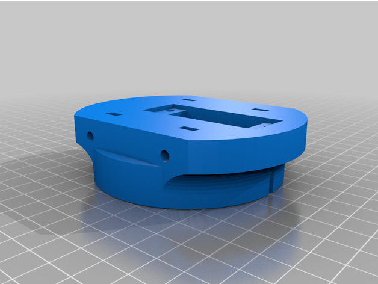 

104                                   |            105                         |            106   
:------------------------------------:|:--------------------------------------:|:--------------------------------------:
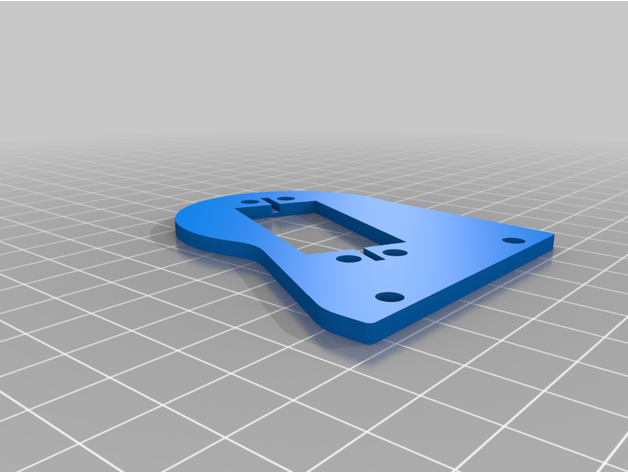  |  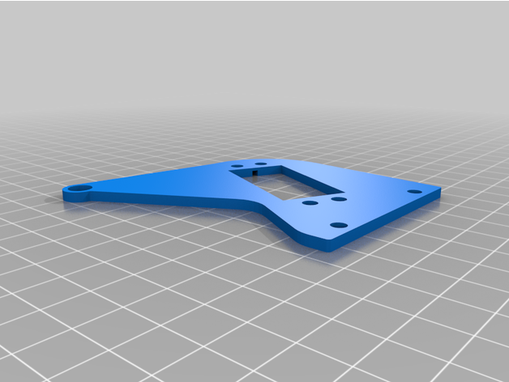  |  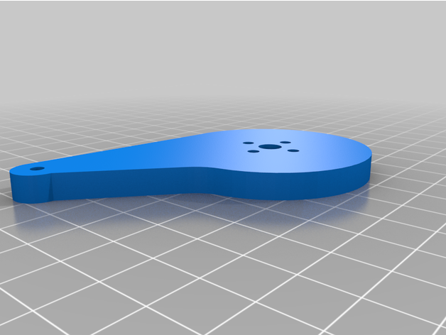

107                                   |            108                         |            150   
:------------------------------------:|:--------------------------------------:|:--------------------------------------:
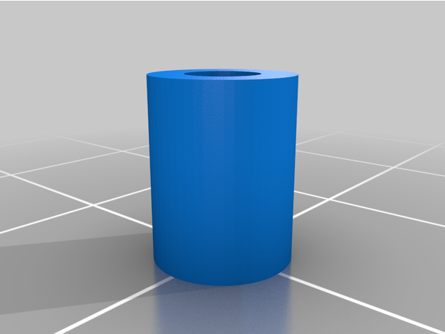  |  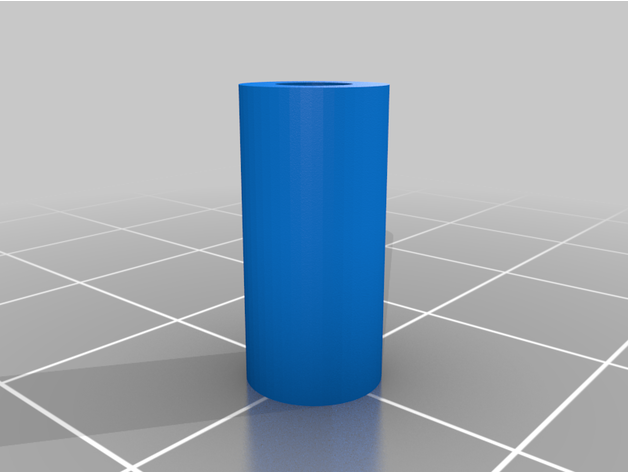  |  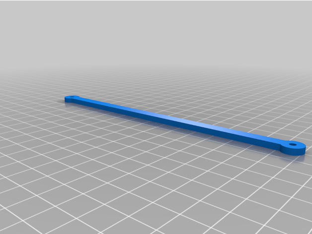

168                                   |            300                         |            301   
:------------------------------------:|:--------------------------------------:|:--------------------------------------:
  |  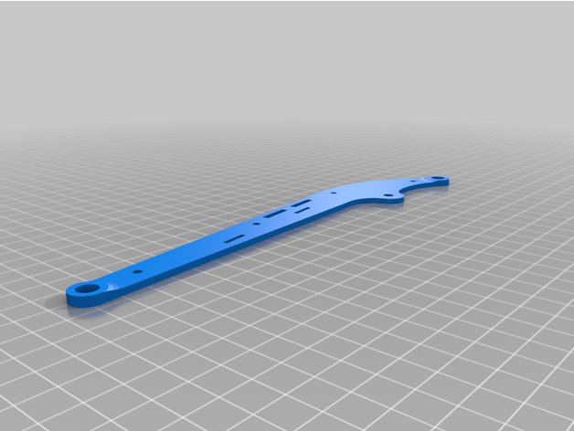  |  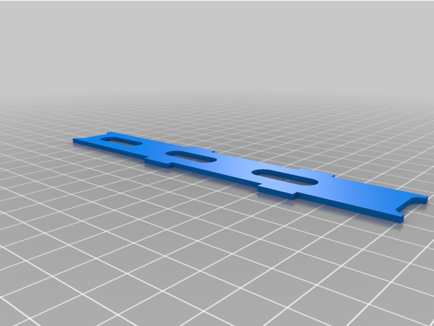

302                                   |            400                         |            401   
:------------------------------------:|:--------------------------------------:|:--------------------------------------:
  |  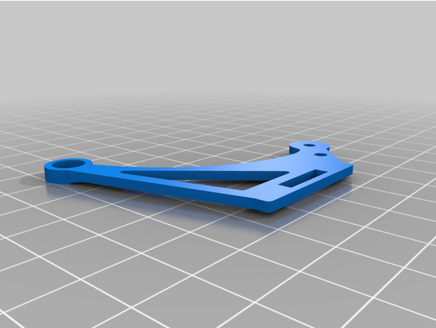  |  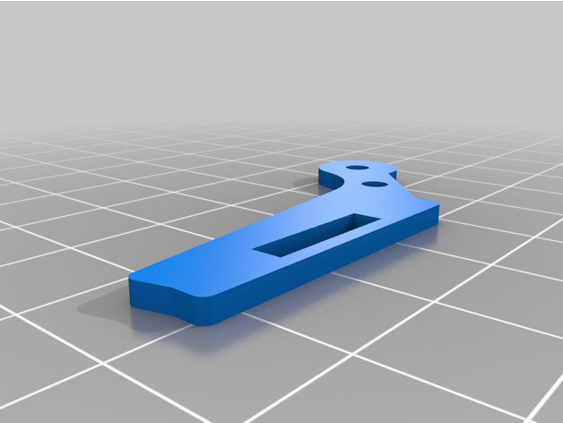

402                                   |            Arbre 6x46                         |            Suport   
:------------------------------------:|:----------------------------------------------|:--------------------------------------:
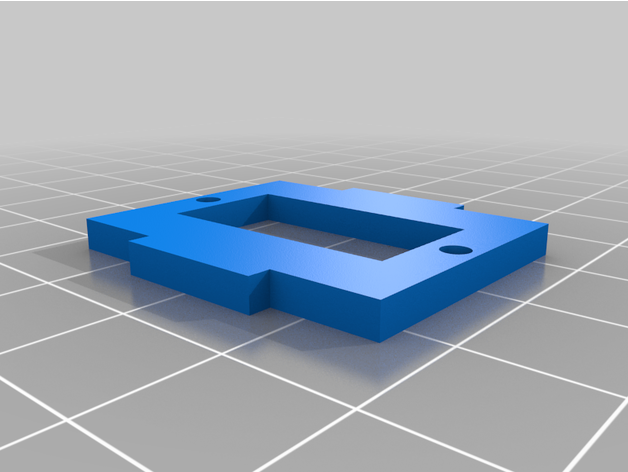  |  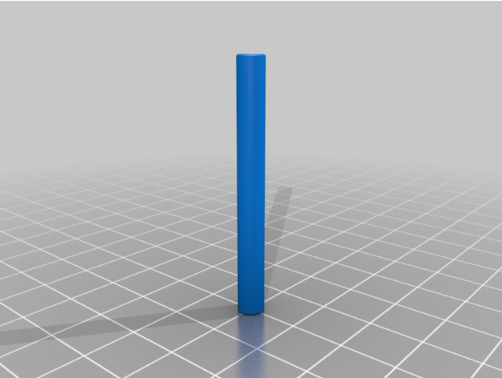  |  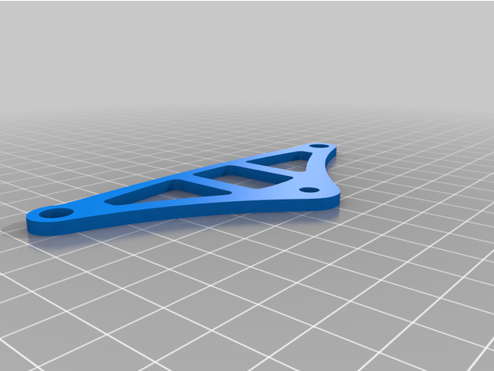

Symétrie 300                                   |
:---------------------------------------------:|
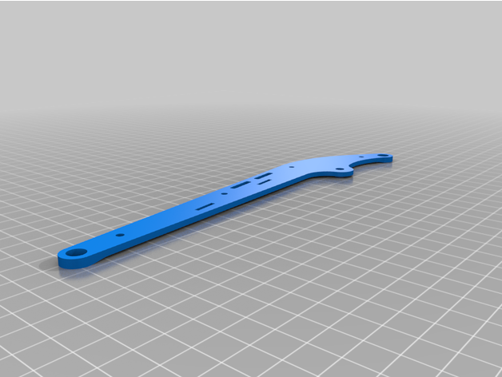  |
***

## Autores

* Gustavo R. Collado - rosellcoll2007@gmail.com
* João Victor G. Prado - jjvgomes14@gmail.com
* Luis F. N. Rotta - rottalipe@gmail.com
* Massiel B. Ramón - massi00br@gmail.com
* Pedro A. de Araújo - pedroarraesdearaujo@gmail.com
* Thiago T. Moura - rpj134@gmail.com

[Centro Universitário FEI, São Bernardo](https://portal.fei.edu.br/)

 

