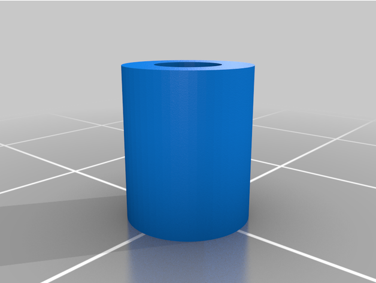

# 🦾 ELA230 - Introdução ao Projeto de Robôs 🦾 

## 📋 Descrição
Repositório com a finalidade de acompanhar o desenvolvimento de um braço robótico de 4 eixos em conjunto com a matéria de Robótica (CCR240).

Para acessar todos os arquivos do Robô [Clique Aqui](docs/robot_files/)
***

## ⚙️ Ambiente Utilizado
* Raspberry Pi 3 B+ 
* PCA9685
***

## Configurando o Ambiente
***

## 🔨 Montagem do Robô
Para acessar o pdf utilizado como base para montagem [Clique Aqui](docs/Robot_4_axes.PDF).

### Peças

001                        |            002
:-------------------------:|:-------------------------:
  |  

100                        |            101
:-------------------------:|:-------------------------:
  |  

102                        |            103
:-------------------------:|:-------------------------:
  |  

104                        |            105
:-------------------------:|:-------------------------:
  |  

106                        |            107
:-------------------------:|:-------------------------:
  |  

108                        |            150
:-------------------------:|:-------------------------:
  |  

168                        |            300
:-------------------------:|:-------------------------:
  |  

301                        |            302
:-------------------------:|:-------------------------:
  |  

400                        |            401
:-------------------------:|:-------------------------:
  |  

402                        |            
:-------------------------:|

